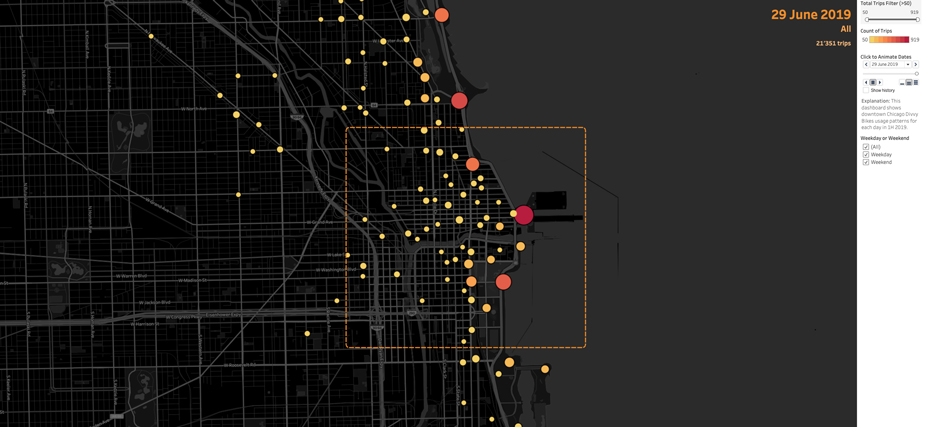

# Tableau Data Analyst Track

#### -- Project Status: [Completed]

## Objective
In this repository, I document my journey of learning Tableau for data analysis, starting with the basics and advancing to more complex visualizations and analysis techniques. Now working as a data analyst, I apply these skills in a professional setting while preparing to enroll in the [Tableau Data Analyst Certification](https://www.tableau.com/learn/certification/certified-data-analyst) to further enhance my expertise in data handling, advanced calculations, and statistical methods.

### Best way to check out latest visualizations
* [mikjf profile via Tableau Public](https://public.tableau.com/app/profile/mikjf/vizzes)

### Case studies
* [Telecom customer churn analysis](https://public.tableau.com/app/profile/mikjf/viz/21_telecom_customer_churn_analysis/Churnanalysis)
* [Tableau in-demand job market analysis](https://public.tableau.com/app/profile/mikjf/viz/46_tableau_focused_job_market/JobAnalytics)

### Topics covered so far
* Getting started
  * Filtering, sorting, aggregation and calculated fields
  * Mapping and geocoding
  * Time series and trends
  
* Analyzing data
  * Data preparation
  * Datediff and distributions
  * Building KPI dashboard
  * Map overlaying
  * Groups, sets and parameters

* Creating dashboards
  * Dashboard objects and actions
  * Layout with containers
  * Updating tooltip with visualizations
  * Sharing data insights
  * Creating and formatting story points
  * Mobile layout customization
  * Navigation implementation

* Dashboarding best practices
  * Analysis process definition
  * Leveraging parameters
  * From dashboards to cohesive stories

* Connecting data
  * Combining and saving data
  * Relationships and extracts
  * Data management
  * Aggregations, hierarchies and filters

* Data visualization
  * Treemaps, heat maps and waterfall charts
  * Interactive web dashboards
  * Maps and spacial visualizations
  * Actions

* Calculations
  * LODs
  * Nested table calculations
  * Time series analysis

* Statistical techniques
  * Univariate EDA
  * Measures of spread and confidence intervals
  * Bivariate EDA
  * Forecasting and clustering
 
### Data and sources
  * The data used belongs to [DataCamp](https://www.datacamp.com/)
